# Nand2Tetris

- my implementation for complete projects
- introduction to the course and each project (all pictures below are from course slides)

### Course Website
[Build a Modern Computer from First Principles: Nand to Tetris Part I](https://www.coursera.org/learn/build-a-computer)

[Build a Modern Computer from First Principles: Nand to Tetris Part II](https://www.coursera.org/learn/nand2tetris2)

[Home | nand2tetris](https://www.nand2tetris.org/)

### Course Introduction

> In this project-centered course you will build a modern computer system, from the ground up. 
> 
> In part I we’ll divide this fascinating journey into six hands-on projects that will take you **from constructing elementary logic gates all the way through creating a fully functioning general purpose computer**. In the process, you will learn - in the most direct and constructive way - how computers work, and how they are designed. 
> 
> In part II you will build a modern software hierarchy, designed to enable the translation and execution of object-based, high-level languages on a bare-bone computer hardware platform. In particular, you will **implement a virtual machine and a compiler for a simple, Java-like programming language, and you will develop a basic operating system that closes gaps between the high-level language and the underlying hardware platform**. In the process, you will gain a deep, hands-on understanding of numerous topics in applied computer science, e.g. stack processing, parsing, code generation, and classical algorithms and data structures for memory management, vector graphics, input-output handling, and various other topics that lie at the very core of every modern computer system.

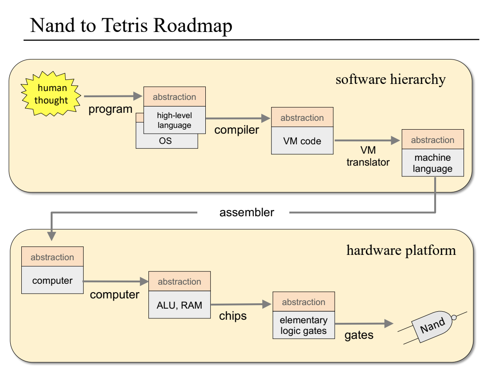

### Project Demonstration
https://github.com/mzshuo/Nand2Tetris/blob/master/images/demo.mp4

### Project Info

##### 1. Elementary Logic Gates
- use HDL (Hardware Discription Language) to implement a set of elementary logic gates like And, Or, Mux, etc.
- as well as their bit-wise versions And16, Or16, Mux16, etc.
- all gates are builded upon built-in NAND gate

##### 2. Boolean Arithmetic
- build a set of chips like HalfAdder, FullAdder, Add16, Inc16
- construct an ALU (Arithmetic-Logic Unit) chip using builed chips
  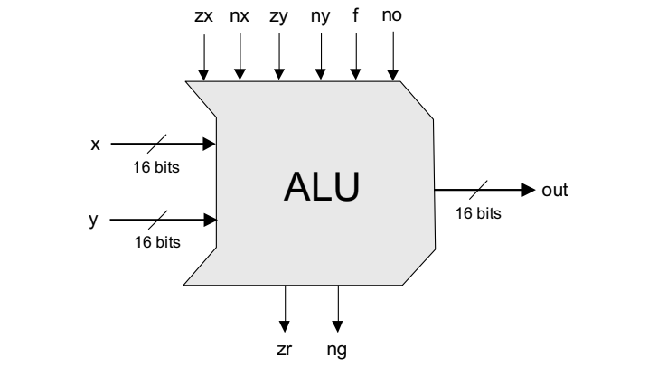

##### 3. Memory
- build chips which can store bits persistently over time, including PC, Register, RAM8, RAM16, etc.
- build a RAM (Random Access Memory) unit using builded chips
  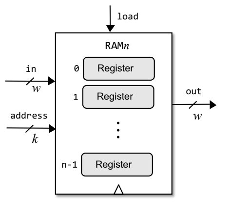

##### 4. Machine Language Programming
- write programs using low-level assembly language which is designed upon Hack instruction set
- (Assembly programming can be highly rewarding, allowing direct and complete control of the underlying machine.)
  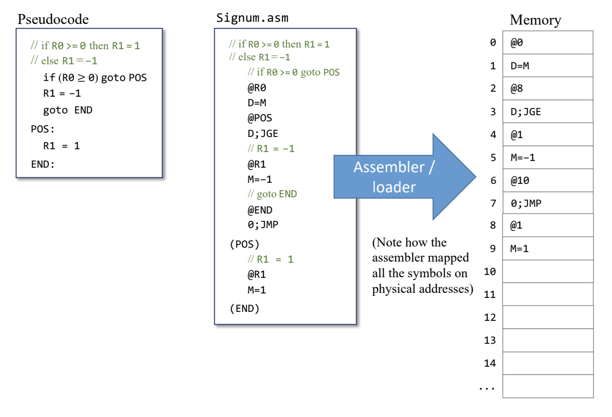

##### 5. Computer Architecture
- construct the Hack CPU (Central Processing Unit)
- construct the Hack hardware platform - memory chip
- put all chips together to yield the top-most Computer chip
  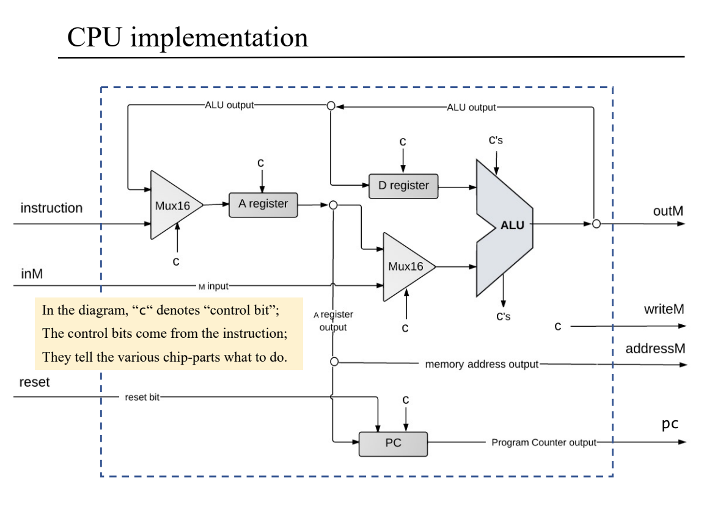
  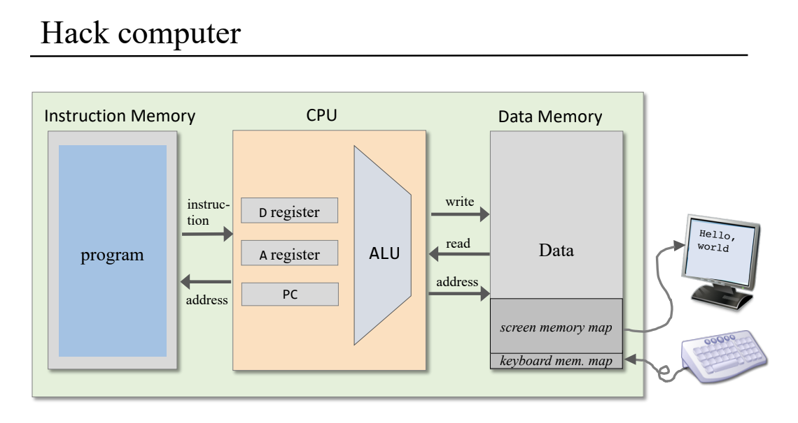

##### 6. The Assembler
- write an Assembler program which can translate symbolic Hack assembly code into binary machine code which can execute on the Hack hardware platform
  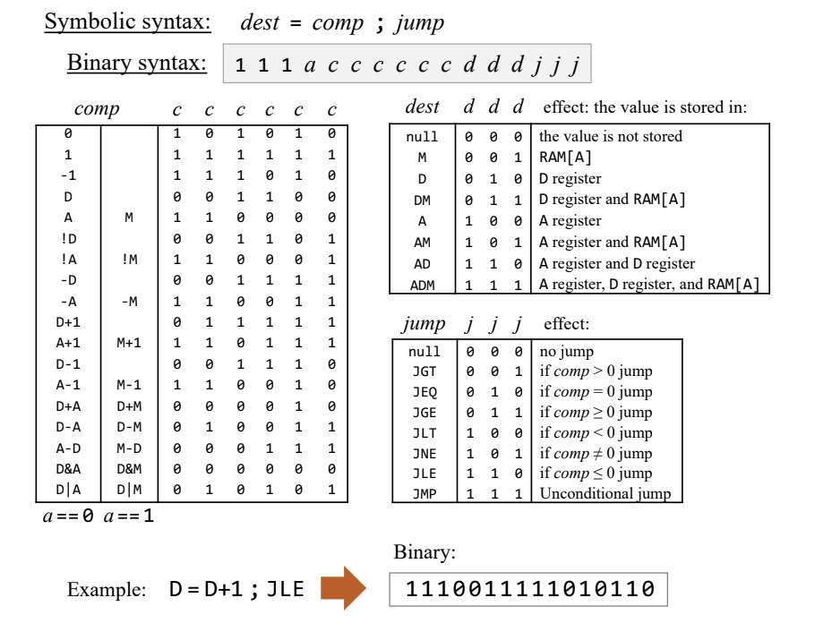

##### 7. Virtual Machine I - Stack Arithmetic
- build a basic VM translator, focusing on the implementation of the VM language's stack arithmetic and memory access commands.
  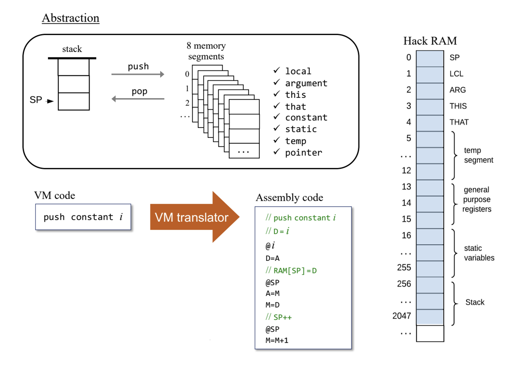

##### 8. Virtual Machine II - Program Control
- extend the basic VM translator into a full-scale VM translator
- implement the VM language's branching and function calling commands
  
  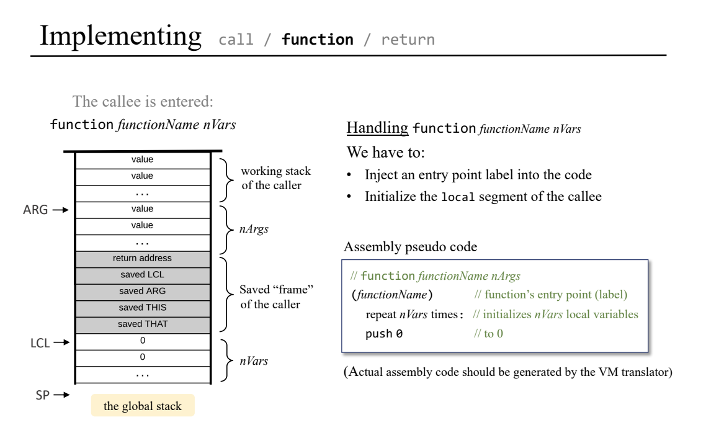
  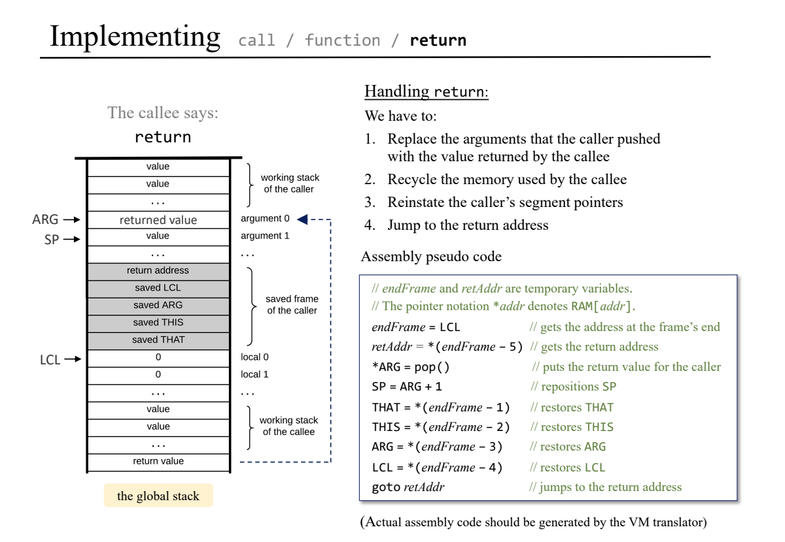

##### 9. High-Level Language
- write a program in *Jack*: a simple, Java-like, object-based programming language
  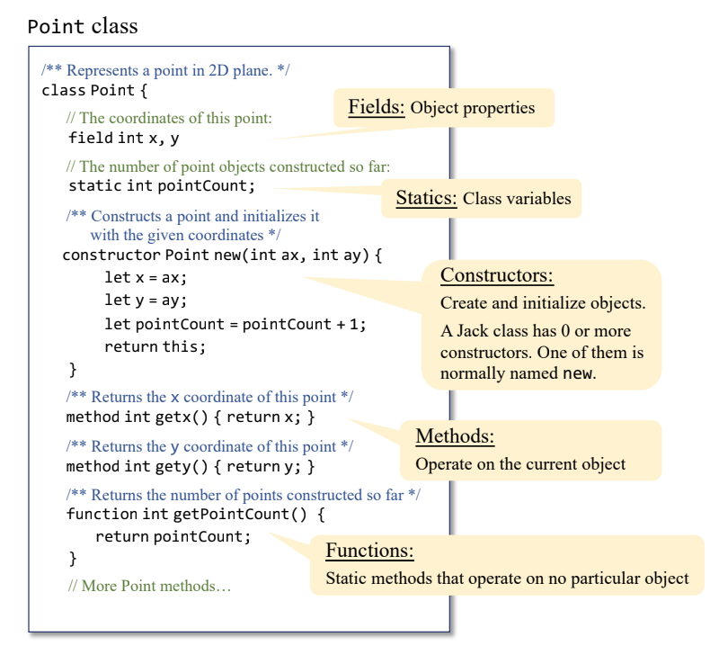

##### 10. Compiler I - Syntax Analysis
- build a syntax analyzer that parses Jack programs according to the Jack grammar
  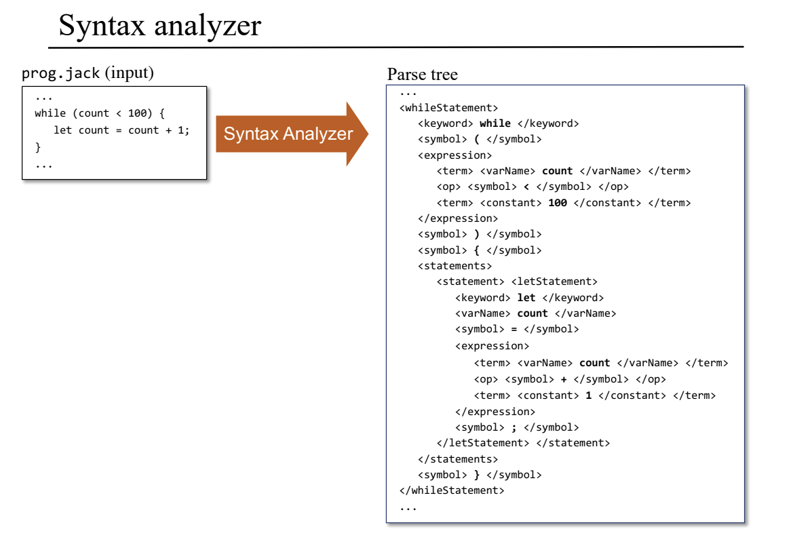

##### 11. Compiler II - Code Generation
- extend the syntax analyzer into a full-scale Jack compiler 
- write routines which translate Jack command into VM language code
  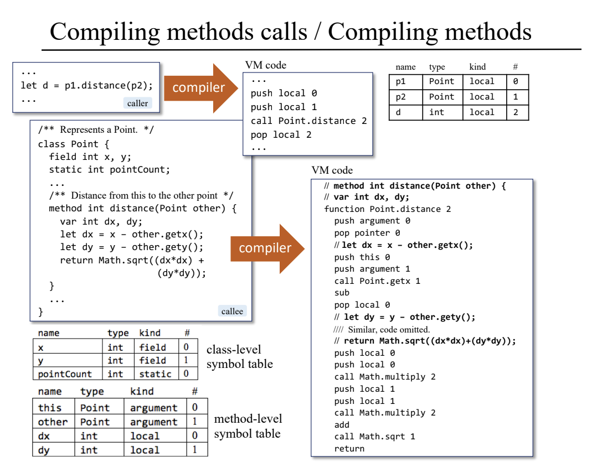

##### 12. Operating System
- implement the Jack operating system which is a collection of software services such as input/output drivers, math operations, string processing, and memory management
  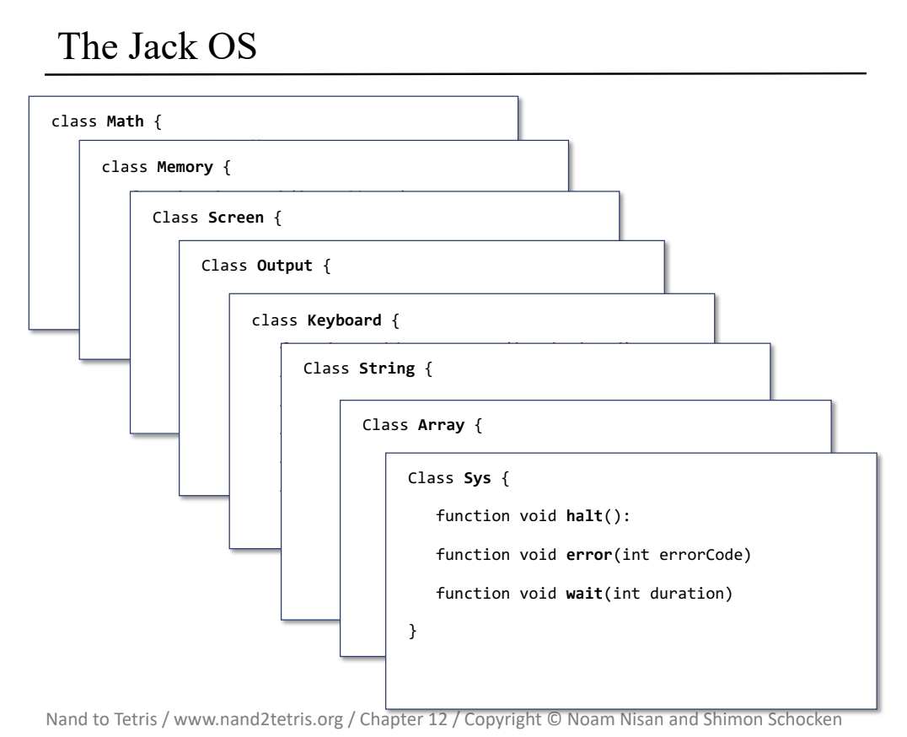

